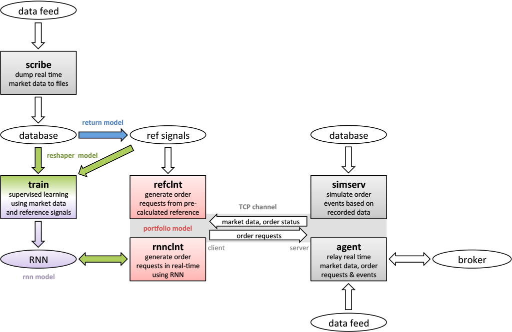
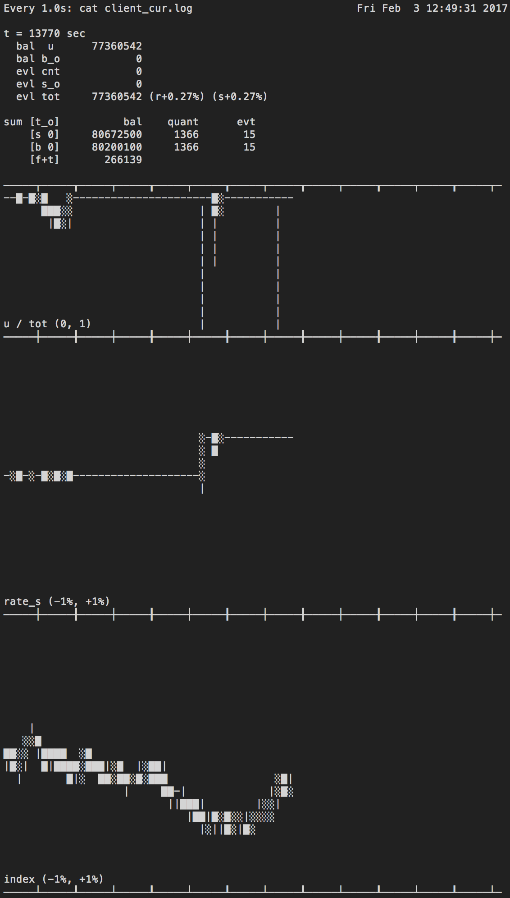

# Sibyl

*Sibyl*
(**S**imulation of **I**ntraday **B**ook and **Y**ield with **L**imit-orders)
is a platform for backtesting and live-trading with real-time intraday
Stock/ETF/ELW data, with a special focus on training and evaluating recurrent
neural networks (RNNs) for forming trade signals.

It adopts a server/client model with a TCP communication channel, allowing
exactly the same code to be used for both backtesting and live-trading, on
distributed systems or within the same system.
- Server side
  - backtesting simulator
  - agent for relaying order request/status to/from a broker
- Client side
  - order request generators using RNNs (for real-time)
  - order request generators using pre-calculated reference target signals
    (for testing)


## Requirements
Project was developed on Ubuntu 16.04.1 LTS using g++ 5.4.0 with `-std=c++11`.
Version numbers are not hard requirements.

### RNN backends
- [Fractal](https://github.com/KyuyeonHwang/Fractal) (commit `261f1fd`)
  : based on C++/CUDA; faster than *Sophia*
- [Sophia](https://github.com/junosan/Sophia) (commit `3ab4359`)
  : based on Python/Theano; less VRAM usage than *Fractal*,
    and more flexibility in experimental RNN structures

With regards to backtesting/live-trading, both backends function identically.

### Common
- [Eigen](http://eigen.tuxfamily.org) (3.3.2)
  : Linear algebra library, used for data preprocessing
- [ZeroMQ](http://zeromq.org) (4.2.0),
  with [C++ binding](https://github.com/zeromq/cppzmq)
  : Messaging library, used for real-time inference using RNNs trained by
    *Sophia* via interprocess communication (IPC) or over a network (TCP)

### Broker frontends (for data collection & live-trading)
This project has been tested extensively in South Korean KOSPI market using 
*Kiwoom Securities* OpenAPI.
Following two repositories provide frontends for collecting real-time data
and executing live trades through this broker.
These are for Windows only, due to restrictions by Kiwoom Securities.

- [KiwoomScribe](https://github.com/junosan/KiwoomScribe)
  : collect level 1 (top of the book quotes and trades) and partial
    level 2 (order book up to ±10 ticks) Stock/ETF/ELW data with
    1 second resolution
- [KiwoomAgent](https://github.com/junosan/KiwoomAgent)
  : relay order requests from *Sibyl* to the market, and market data &
    order status updates from the market to *Sibyl*


## Block diagram
The operations of data collection, modeling, training, backtesting,
and live-trading are summarized in the following diagram.



There are 4 constituents of a trading model in this diagram:
- **Return model**
  : given the state (possibly also including past and *future* states) of a
    security, determines expected return of an action;
    this is not a part of this repository
- **Reshaper model**
  : process input & target/output of RNN in a way that makes more sense
    for a RNN to learn;
    `class Reshaper` in `src/core/rnn` and its derived classes
- **RNN model**
  : given preprocessed input, generate output, which becomes a real-time
    estimation of the target after Reshaper processing;
    `class TradeNet` in `src/core/rnn` and its derived classes
- **Portfolio model**
  : given a set of returns of different security items, determines the price,
    size, and timing of order requests;
    `class Model` in `src/core/sibyl/client` and its derived classes


## Programs in this repository

Common:
- **simserv**: backtesting simulation server
- **refclnt**: send order requests from pre-calculated reference target
               signals; intended for testing portfolio strategies

For *Fractal*:
- **train**: train an RNN using *Fractal*
- **rnnclnt**: send real-time order requests using RNNs trained by *Fractal*

For *Sophia*:
- **sophia**: send real-time order requests using RNNs trained by *Sophia*
              via interprocess communication (IPC) or over a network (TCP)
              with `sophia.py`; equivalent to **rnnclnt**
              (*Sophia*'s train.py is equivalent to **train**)
- **reshape_dataset**: batch preprocess (Reshaper model)
                       data in suitable format for *Sophia*


# How to use

## Directory structure

The script files included in directory `run` show how to train,
backtest (also see Sample Data section below), and execute live trades.
They assume the following directory structure.
This isn't the most logical of structures, so change
them if you want (in particular, `MATLAB` is just a name here).

```
    $ROOT (a base directory, not /)
      MATLAB
        Data (zipped plain text market data for each date)
        DataV (zipped transformed binary data for each date)
        fractal
          DataV (unzipped and split into train/dev set for training)
      Sibyl (this repository, cloned)
        src (source code)
        run (script and config files)
        bin (compiled binary)
      Sophia
        src (Sophia repository, cloned)
        run (script files for training)
      reshaped_dataset (batch preprocessed data for Sophia)
      workspace (RNN models saved here)
```


## Preparing data
This repository does not contain materials for preparing the data, but
it is still discussed below for completeness.

### Collecting real-time intraday market data
See *KiwoomScribe* for data format.

*KiwoomScribe* collects ca. 500 security items per day, and each security
item comprises 2 to 4 plain text files (trade events, order book events, etc).
Data is ca. 30 MB compressed (ca. 900 MB raw) for each date.
Zipped for each date and placed in `$ROOT/MATLAB/Data` as `$YYYYMMDD.zip`.

### Converting market data to `.raw`/`.ref` files (Return model)
Binary files for training RNNs. 
- `.raw`: raw market data;
          after preprocessing by `class Reshaper`, becomes input for RNN
- `.ref`: transformed market data, a.k.a. signals (this transformation is not
          a part of this repository);
          after preprocessing by `class Reshaper`, becomes target for RNN

See `src/core/rnn/TradeDataSet.cc` for binary data formats.
Zipped for each date and placed in `$ROOT/MATLAB/DataV` as `$YYYYMMDD.zip`.

### Splitting train/dev/test sets
Make sure only the binary data for train + dev set are in `$ROOT/MATLAB/DataV`
(binary data aren't needed for the test set).

```
NOTE: NEEDS REVISION
```

From `$ROOT/MATLAB/fractal`
- (Optional) Run `gen_rand_datalist.sh` and `parse_datalist.sh` to randomly
  designate specific dates to be put in dev set (stored as `devset.txt`)
- Edit and run `prepare_data.sh`
  - this unzips the files from `$ROOT/MATLAB/DataV`
    to `$ROOT/MATLAB/fractal/DataV` and creates a sequence list `list.txt`
- Edit and run `split_dataset.sh`
  - this takes a list of dates to be put in the dev set from `devset.txt`
    and splits the dataset
  - results are two files `train.list` and `dev.list` containing relative
    paths (excluding extension) to the sequences in each dataset


## Training/backtesting/live-trading using *Fractal*

### Training
- Compile `train` from `$ROOT/Sibyl/src/train`
  - choose the TradeNet (which defines neural net architecture) and Reshaper
    in `train.cc`
  - `make clean`, then `make`
  - assumes required libraries installed in the global zone
    (`/usr/local/include`, `/usr/local/lib`)
- Run `$ROOT/Sibyl/run/train/train_batch_0.sh`
  - set paths of binaries, dataset, and workspace in the script file
  - multiple training sessions can be queued to be run in sequence
  - multiple training sessions can be run simultaneously if you have
    multiple GPUs; see `$ROOT/Sibyl/run/train/train_batch_1.sh`

### Backtesting
- Compile `simserv` from `$ROOT/Sibyl/src/simserv` with `make`
- Compile `rnnclnt` from `$ROOT/Sibyl/src/rnnclnt`
  - choose the TradeNet and Reshaper in `rnnclnt.cc`;
    these should be the same as those chosen during training
  - `make clean`, then `make`
- Use script files in `$ROOT/Sibyl/run/rnn`
  - `run_g.sh`: runs backtest for a single date `$1`
    - `workspace.list` chooses which trained RNN to use
      (can run multiple in ensemble)
    - `simserv`, `class Model`, and `class Reshaper` each take a configuration
      file as referred to in `run_g.sh`, which need to be set as needed
    - see Screenshot section below for instructions on live monitoring
  - `run_g_list.sh`: using `run_g.sh`, run all dates in a date list file `$1`
  - `run_g_scan_param.sh`: using `run_g_list.sh`, repeatedly run full date list
                           while changing configuration files
                           (for performing parameter optimization)

### Live-trading
- Launch an agent (e.g., KiwoomAgent), possibly on a different machine
- Run `$ROOT/Sibyl/run/rnn/net.sh`
  - set address & port of the agent's machine in the script file
  - set configuration files referred to in the script file


## Training/backtesting/live-trading using *Sophia*

### Training
- Compile `reshape_dataset` from `$ROOT/Sibyl/src/reshape_dataset`
  - choose the Reshaper in `reshape_dateset.cc`
  - `make clean`, then `make`
  - may need to correct the library paths in `Makefile`
- Run `$ROOT/Sibyl/run/reshape_dataset/reshape.sh` after setting paths in
  the script file
- Run `$ROOT/Sophia/run/train_0.sh`
  - neural net structure is configured directly in `$ROOT/Sophia/src/train.py`
  - similar to above, multiple training sessions can be run in sequence or in
    parallel

### Backtesting/live-trading
- Compile `simserv` from `$ROOT/Sibyl/src/simserv` with `make`
- Compile `sophia` from `$ROOT/Sibyl/src/sophia`
  - choose the Reshaper in `sophia.cc`; should be the same as that for training
  - `make clean`, then `make`
- Use script files in `$ROOT/Sibyl/run/sophia`
  - they function identically to those in `$ROOT/Sibyl/run/rnn`


# Screenshot

While operating, client updates `$ROOT/Sibyl/bin/state/client_cur.log`
in real-time to show a summary of what's going on.
This file can be `watch cat`'ed in the terminal to monitor the current state
of backtesting/live-trading.
Note that this is only meant to be a quick-glance summary; full logs are
stored in `$ROOT/Sibyl/bin/log`, in human-readable and binary formats.



Statistics legend
- `bal u`: unused balance
- `bal b_o`: balance staged as buy orders
- `evl cnt`: estimated value of securities in hand, not staged in the market
- `evl s_o`: estimated value of securities staged as sell orders
- `evl tot`: grand total
- `r+#.##%`: profit rate wrt the reference prices (last date's ending prices)
- `s+#.##%`: profit rate wrt the starting prices
- `bal/quant/evt`: balance (or estimated value)/quantity/events
- `[t_o]`: original relative price tick at which orders were placed
- `[s 0]`: at immediate sell price (a.k.a. ps0 = highest bid price)
- `[b 0]`: at immediate buy price (a.k.a. pb0 = lowest ask price)
- `[f+t]`: fee + taxes

Screenshot above shows statistics only for the 0-th relative price ticks
(immediate orders only), as only these were assumed in the
Return/Portfolio/Reshaper models in use. However, the simulator is able to
handle arbitrarily priced limit-orders (within the collected tick data range).

Charts legend
- `░`: between starting/ending values of a rising segment
- `█`: between starting/ending values of a falling segment
- `|`: between high/low values of a segment (if not masked by above)
- `-`: no change
- top chart: ratio of unused balance
- middle chart: profit rate wrt the starting prices (in %, auto-scales)
- bottom chart: market's main index (in above screenshot, KOSPI200)


# Sample data
[Releases page](https://github.com/junosan/Sibyl/releases) includes sample
data and pre-trained RNNs to demonstrate the backtesting feature.

- Install the requirements
  (*Fractal* and *Eigen* are required, *Sophia* (+*ZeroMQ*) is optional)
  - *Fractal* (requires CUDA): install to `/usr/local/{include,lib}`
  - *Sophia* (requires Theano & CUDA): copy `.py` files to `$ROOT/Sophia/src`
    - *ZeroMQ*: install to `/usr/local/{include,lib}`;
      *cppzmq* is header-only and should be installed to `/usr/local/include`
  - *Eigen*: header-only; install to `/usr/local/include/Eigen`
- Copy the zipped market data into `$ROOT/MATLAB/Data/$DATE.zip`
- Copy the workspace directories into `$ROOT/workspace/$WORKSPACE_NAME`
- See Backtesting sections above for launching backtests with either *Fractal*
  or *Sophia*
  - Script files and config files in `$ROOT/Sibyl/run/rnn` (for *Fractal*)
    and `$ROOT/Sibyl/run/sophia` (for *Sophia*) are preconfigured to launch
    backtests on the sample data with appropriate model parameters
  - In either directory, run `./run_g_list.sh comb.txt`
